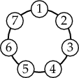
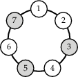
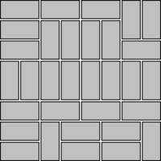
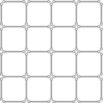
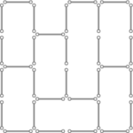
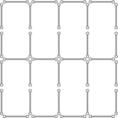
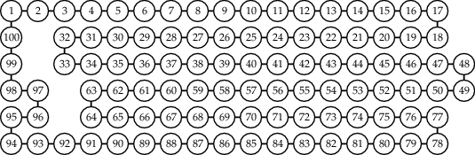
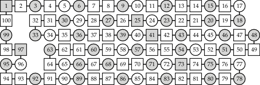

# CLP(B): Constraint Logic Programming over Boolean variables

CLP(B), Constraint Logic Programming over Boolean variables, is
available in SWI-Prolog as
[**library(clpb)**](http://www.swi-prolog.org/man/clpb.html).

This repository contains usage examples and tests of the library.

## Using CLP(B) constraints

Many of the examples use
[**DCG notation**](http://www.metalevel.at/dcg.html) to describe
lists, and in particular: lists of *clauses*. This lets you easily
reason about the constraints that are being posted, change the order
in which the are posted, and in general more conveniently experiment
with&nbsp;CLP(B). It is sometimes faster to post a single big
conjunction instead of several smaller ones.

I recommend you start with the following examples:

1. [**knights_and_knaves.pl**](knights_and_knaves.pl): Solution of
   several Boolean puzzles that appear in Raymond Smullyan's _What Is
   the Name of this Book_ and Maurice Kraitchik's _Mathematical
   Recreations_. A good starting point for learning more about CLP(B).

2. [**matchsticks.pl**](matchsticks.pl): A puzzle involving
   matchsticks. See below for more information.

3. [**cycle_n.pl**](cycle_n.pl): Expresses independent sets and
   maximal independent sets (also called *kernels*) of the
   [cycle graph](https://en.wikipedia.org/wiki/Cycle_graph)&nbsp;<i>CN</i>.
   
      

    See below for more information about weighted solutions.

4. [**euler_172.pl**](euler_172.pl): CLP(B) solution of Project Euler
   [Problem 172](https://projecteuler.net/problem=172): How many
   18-digit numbers&nbsp;<i>n</i> (without leading zeros) are there
   such that no digit occurs more than three times in&nbsp;<i>n</i>?

5. [**domino_tiling.pl**](domino_tiling.pl): Domino tiling of an
   <i>M&times;N</i>&nbsp;chessboard. Using CLP(B), it is easy to see
   that there are 12,988,816&nbsp;ways to cover an
   8&times;8&nbsp;chessboard with dominoes:
   
      

   Interestingly, the
   [Fibonacci numbers](http://mathworld.wolfram.com/FibonacciNumber.html)
   arise when we count the number of domino tilings of
   <b>2</b>&times;N&nbsp;chessboards. An example is shown in the right
   figure.

Other examples are useful as benchmarks:

- [**langford.pl**](langford.pl): Count the number of [Langford pairings](https://en.wikipedia.org/wiki/Langford_pairing).
- [**n_queens.pl**](n_queens.pl): CLP(B) formulation of the
  [N-queens puzzle](https://en.wikipedia.org/wiki/Eight_queens_puzzle).
- [**pigeon.pl**](pigeon.pl): A simple allocation task.
- [**schur.pl**](schur.pl): A problem related to
  [Schur's number](http://mathworld.wolfram.com/SchurNumber.html) as
  known from
  [Ramsey theory](http://mathworld.wolfram.com/RamseyTheory.html).

### Matchsticks puzzle

In [**matchsticks.pl**](matchsticks.pl), Boolean variables indicate
whether a matchstick is placed at a specific position. The task is to
eliminate all subsquares from the initial configuration in such a way
that the maximum number of matchsticks is left in place:

 

We can use the CLP(B) predicate `weighted_maximum/3` to show that we
need to remove at least 9 matchsticks to eliminate all subsquares.

   

The left figure shows a sample solution, leaving the maximum number of
matchsticks&nbsp;(31) in place. If you keep more matchsticks in place,
subsquares will remain. For example, the right figure contains exactly
7&nbsp;subsquares, including the 4x4 outer square.

CLP(B) constraints can be used to quickly generate, test and count
solutions of such puzzles, among many other applications. For example,
there are precisely 62,382,215,032 subsquare-free configurations that
use exactly 18&nbsp;matchsticks. This is the maximum number of such
configurations for any fixed number of matchsticks on this grid.

### Independent sets and weighted kernels

As another example, consider the following graph:

 

It is the so-called
[_cycle graph_](https://en.wikipedia.org/wiki/Cycle_graph) with
100&nbsp;nodes, <i>C100</i>. Using CLP(B) constraints, it
is easy to see that this graph has exactly 792,070,839,848,372,253,127
_independent sets_, and exactly 1,630,580,875,002 _maximal_
independent sets, which are also called _kernels_. The gray nodes in
the next picture show one such kernel:

 

This is also a kernel of _maximum weight_ if the weight of each node
is its _Thue-Morse code_ (see [**cycle_n.pl**](cycle_n.pl) for more
details). Nodes with negative weights are drawn as squares.

Only 5 nodes (1, 25, 41, 73 and 97) of this kernel with 38 nodes have
negative weights in this case, for a total weight of 28. There are
exactly 256 kernels of maximum weight in this case. There are exactly
25,446,195,000 kernels with exactly 38 nodes. All kernels have between
34 and 50 nodes. For any fixed number of nodes, the maximum number of
kernels (492,957,660,000) is attained with 41 nodes, and among these
kernels, the maximum total Thue-Morse weight is 25.

By negating the coefficients of `maximum_weight/3`, we can also find
kernels with _minimum_ weight. For example:

 

## Alternative ZDD-based version of `library(clpb)`

There is a limited alternative version of `library(clpb)`, based on
Zero-suppressed Binary Decision Diagrams (ZDDs).

Please see the [**zdd**](zdd) directory for more information. Try the
ZDD-based version for tasks where the BDD-based version runs out of
memory. You must use `zdd_set_vars/1` before using `sat/1` though.

## Acknowledgments

I am extremely grateful to:

[**Jan Wielemaker**](http://www.swi-prolog.org) for providing the
Prolog system that made all this possible in the first place.

[**Ulrich Neumerkel**](http://www.complang.tuwien.ac.at/ulrich/), who
introduced me to constraint logic programming and CLP(B) in
particular. If you are teaching Prolog, I strongly recommend you check
out his
[GUPU&nbsp;system](http://www.complang.tuwien.ac.at/ulrich/gupu/).

[**Nysret Musliu**](http://dbai.tuwien.ac.at/staff/musliu/), my thesis
advisor, whose interest in combinatorial tasks, constraint
satisfaction and SAT&nbsp;solving highly motivated me to work in this
area.

[**Mats Carlsson**](https://www.sics.se/~matsc/), the designer and
main implementor of SICStus Prolog and its visionary
[CLP(B)&nbsp;library](https://sicstus.sics.se/sicstus/docs/latest4/html/sicstus.html/lib_002dclpb.html#lib_002dclpb).
For any serious use of Prolog and constraints, make sure to check out
his elegant and fast system.

[**Donald Knuth**](http://www-cs-faculty.stanford.edu/~uno/) for the
superb treatment of BDDs and&nbsp;ZDDs in his books and programs.
