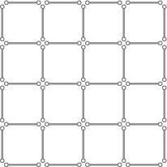
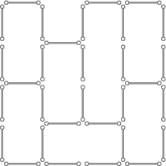
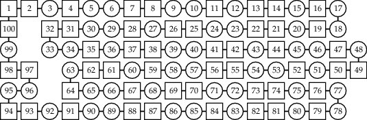

### `library(clpb)` ships with SWI-Prolog

CLP(B), Constraint Logic Programming over Boolean variables, is
included in SWI-Prolog as
[library(clpb)](http://www.swi-prolog.org/man/clpb.html).

This repository contains usage examples and tests of the library.

### Using CLP(B) constraints

#### Puzzles

**Example** of Boolean variables: Indicate whether a matchstick is
placed at a specific position ([matchsticks.pl](matchsticks.pl)).

We can use the CLP(B) predicate `weighted_maximum/3` to show that we
need to remove at least 9 matchsticks to eliminate all subsquares.
Sample solution, leaving the maximum number of matchsticks in place:

Note that subsquares will remain if you keep more matchsticks in
place. For example, the following configuration contains exactly 7
subsquares, including the 4x4 outer square:

CLP(B) constraints can be used to quickly generate, test and count
solutions of such puzzles, among many other applications. For example,
there are precisely 62,382,215,032 subsquare-free configurations that
use exactly 18 matchsticks. This is the maximum number of such
configurations for any fixed number of matchsticks on this grid.

#### Independent sets and weighted kernels

As another example, consider the following graph:

It is the so-called _cycle graph_ with 100 nodes, C_100. Using CLP(B)
constraints, it is easy to see that this graph has exactly
792,070,839,848,372,253,127 _independent sets_, and exactly
1,630,580,875,002 _maximal_ independent sets, which are also called
_kernels_. The gray nodes in the next picture show one such kernel:

This is also a kernel of _maximum weight_ if the weight of each node
is its _Thue-Morse code_ (see [cycle_n.pl](cycle_n.pl) for more
details). Nodes with negative weights are drawn as squares.

Only 5 nodes (1, 25, 41, 73 and 97) of this kernel with 38 nodes have
negative weights in this case, for a total weight of 28. There are
exactly 256 kernels of maximum weight in this case. There are exactly
25,446,195,000 kernels with exactly 38 nodes. All kernels have between
34 and 50 nodes. For any fixed number of nodes, the maximum number of
kernels (492,957,660,000) is attained with 41 nodes, and among these
kernels, the maximum total Thue-Morse weight is 25.

By negating the coefficients of `maximum_weight/3`, we can also find
kernels with _minimum_ weight. For example:

### Alternative ZDD-based version of `library(clpb)`

There is a limited alternative version of `library(clpb)`, based on
Zero-suppressed Binary Decision Diagrams (ZDDs).

Please see the [zdd](zdd) directory for more information. Try the
ZDD-based version for tasks where the BDD-based version runs out of
memory. You must use `zdd_set_vars/1` before using `sat/1` though.
