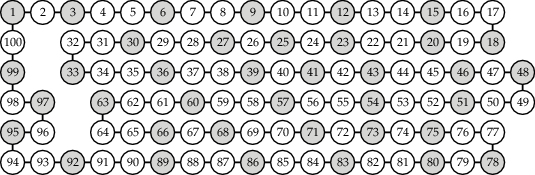

CLP(B) is now included in SWI-Prolog as
[library(clpb)](http://www.swi-prolog.org/man/clpb.html).

Please see http://www.github.com/SWI-Prolog for the latest version.

This repository contains usage examples and tests of the library.

**Example** of Boolean variables: Indicate whether a matchstick should
be placed at a specific position ([matchsticks.pl](matchsticks.pl)).

We can use the CLP(B) predicate `weighted_maximum/3` to show that we
need to remove at least 9 matchsticks to eliminate all subsquares.
Sample solution, leaving the maximum number of matchsticks in place:

Note that subsquares will remain if you keep more matchsticks in
place. For example, the following configuration contains exactly 7
subsquares, including the 4x4 outer square:

CLP(B) constraints can be used to quickly generate, test and count
solutions of such puzzles, among many other applications. For example,
there are precisely 62,382,215,032 subsquare-free configurations that
use exactly 18 matchsticks. This is the maximum number of such
configurations for any fixed number of matchsticks on this grid.

As another example, consider the following graph:

It is the so-called cycle graph with 100 nodes, C_100. This graph has
exactly 792,070,839,848,372,253,127 _independent sets_, and exactly
1,630,580,875,002 _maximal_ independent sets, which are also called
_kernels_. The gray nodes in the image above show one such kernel. It
is also a kernel of _maximum weight_ if the weight of each node is its
_Thue-Morse code_ (see [cycle_n.pl](cycle_n.pl) for more details).

Only 5 nodes (1, 25, 41, 73 and 97) of this independent set with 38
vertices have negative weights in this case, for a total weight of 28.
There are exactly 256 solutions of maximum weight in this case.

### Alternative ZDD-based version of `library(clpb)`

There is a limited alternative version of `library(clpb)`, based on
Zero-suppressed Binary Decision Diagrams (ZDDs).

Please see the [zdd](zdd) directory for more information. Try the
ZDD-based version for tasks where the BDD-based version runs out of
memory. You must use `zdd_set_vars/1` before using `sat/1` though.
