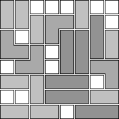

# ZDD-based variant of `library(clpb)`

Zero-suppressed Binary Decision Diagrams (ZDDs) can save a lot of
memory when most Boolean variables are equal to&nbsp;0 in solutions.
This is the case in many covering tasks.

[**clpb.pl**](clpb.pl) is a ZDD-based variant of `library(clpb)`. It
is mostly a drop-in-replacement for the library that ships with
SWI-Prolog, with the following important difference: Before using
`sat/1`, you *must* call `zdd_set_vars/1` with a list of all Boolean
variables that occur in your model.

## Examples

### Polyomino tilings

This variant of the library can be used to more space-efficiently
compute that there are exactly
92,109,458,286,284,989,468,604&nbsp;ways to cover an
8&times;8&nbsp;chessboard with monominoes, dominoes and trominoes. See
[**polyomino_tiling.pl**](polyomino_tiling.pl) for more information.

In addition, as with `library(clpb)`, solutions can also be picked in
such a way that each solution is equally likely.

Sample solution:

 

## Limitations

There are currently some limitations, mostly due to shortcomings of
SWI-Prolog's interface for attributed variables (see
[Issue&nbsp;#14](https://github.com/SWI-Prolog/roadmap/issues/14)):

- unification of CLP(B) variables is *not* yet implemented in this variant
- `labeling/1` does *not* work yet

In addition, `card/2` does not yet support integer ranges.

Please see the [source file](clpb.pl) for more information about these
issues.
